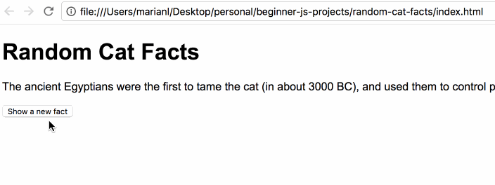

# Random Cat Facts
A quick project that gathers facts from the [Random Fact API page](https://fact.birb.pw/) and places it onto a web page. For the actual facts, click here: [Cat Facts API endpoint](https://fact.birb.pw/api/v1/cat).

## To-Do
* Create an object that lists cat facts
* Create a function that chooses a random fact
* Display the result of that function on the webpage

## Expected outcomes

## Dazzlers
* Use [AJAX](https://developer.mozilla.org/en-US/docs/Web/Guide/AJAX) to grab the [JSON](https://developer.mozilla.org/en-US/docs/Learn/JavaScript/Objects/JSON) from the cat facts endpoint and put it on your page

## Resources
* [JavaScript object basics](https://developer.mozilla.org/en-US/docs/Learn/JavaScript/Objects/Basics)
* [Working with objects](https://developer.mozilla.org/en-US/docs/Web/JavaScript/Guide/Working_with_Objects)
* [Math.random()](https://developer.mozilla.org/en-US/docs/Web/JavaScript/Reference/Global_Objects/Math/random)
* [Event Listeners](https://developer.mozilla.org/en-US/docs/Web/API/EventTarget/addEventListener)
