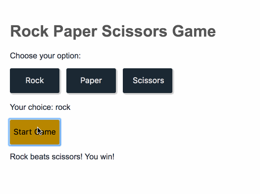

# Rock Paper Scissors
You're going to program the classic game! In this app, the player will select which "instrument" they will pick (rock, paper, or scissors). Then they'll press a button to start the game against the browser. See GIF below:

## To-Do
* Add click events for each of the buttons ("Rock", "Paper", "Scissors", "Start game")
 * See resource on Event Listeners
* Decide how the browser will choose what option to pick
 * Hint: the browser doesn't know what "scissors" is, but it could associate a given number with "scissors"; see resource on operations and Math.random
* Compare the option that the user chooses with the option the browser chooses
 * Write the logic to determine the winner for a given match-up; see resource on operations

## Expected outcomes
See above GIF

## Dazzlers
* Add images for the actual items
* Add mouseover events for the "Rock", "Paper", "Scissors" buttons
* Add a counter near the "Start game" button to track how many games have been played

## Resources
Here's a starter list of helpful documentation for the given project:
* [Event Listeners](https://developer.mozilla.org/en-US/docs/Web/API/EventTarget/addEventListener)
* [Conditionals](https://developer.mozilla.org/en-US/docs/Learn/JavaScript/Building_blocks/conditionals)
* [Operations](https://developer.mozilla.org/en-US/docs/Web/JavaScript/Reference/Operators/Arithmetic_Operators)
* [Math.random()](https://developer.mozilla.org/en-US/docs/Web/JavaScript/Reference/Global_Objects/Math/random)
* [document.querySelector()](https://developer.mozilla.org/en-US/docs/Web/API/Document/querySelector)
