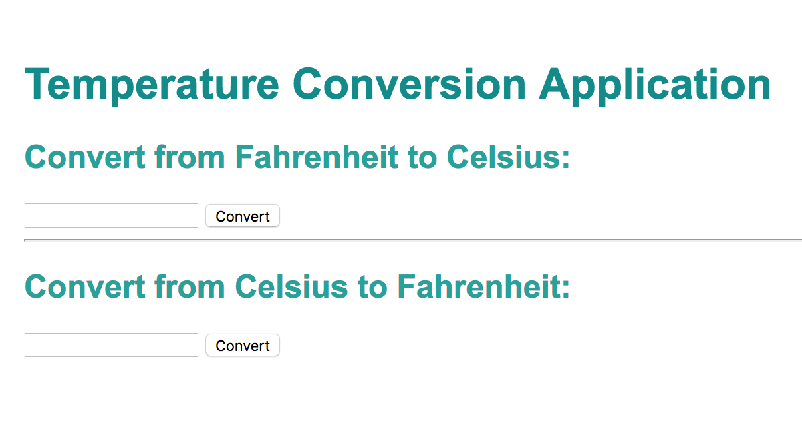
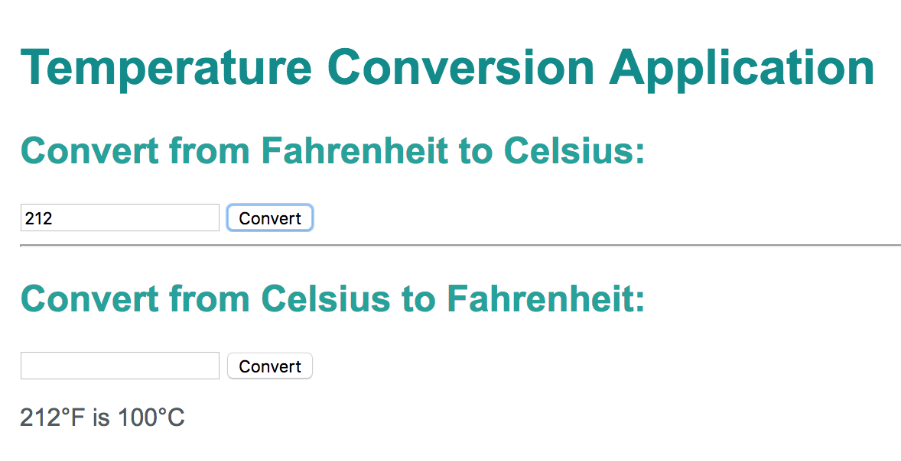

# Temperature Conversion
This is a web app that converts a given temperature (in either Fahrenheit or Celsius) and converts the number into the other unit (either Celsius or Fahrenheit).

## To-Do
* Create the functions for both conversions (Fahrenheit to Celsius; Celsius to Fahrenheit)
* Create two separate events that each convert the temperature to the other unit when the "Convert" button is pressed
 * See resource on Event Listeners

## Expected outcomes

## Dazzlers (extras)
* Add a section to convert the temperature into Kelvin from both units (and vice versa from Kelvin)

## Resources:
Here's a starter list of helpful documentation for the given project:
* [Passing parameters in functions](https://developer.mozilla.org/en-US/docs/Web/JavaScript/Guide/Functions)
* [Event Listeners](https://developer.mozilla.org/en-US/docs/Web/API/EventTarget/addEventListener)
* [Operations](https://developer.mozilla.org/en-US/docs/Web/JavaScript/Reference/Operators/Arithmetic_Operators)
